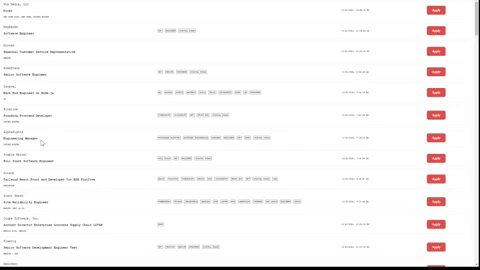

# Remote Job Board via Remote|OK
## <code>[LIVE VIEW](https://remote-jobboard.netlify.app/)</code>
## Remote Job Board is single page application built with Vanilla Javascript
### Utilized the classic XMLHTTPRequest to request data from the open source RemoteOK.io api
### Displays job opportunities requested from an open API and allow users to click a button which will link the user to the job description with Remoteok.io

